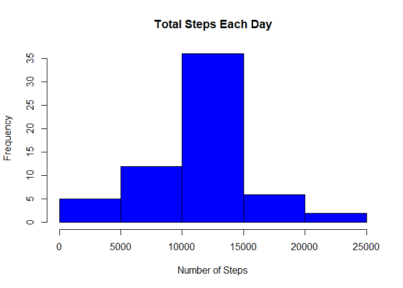
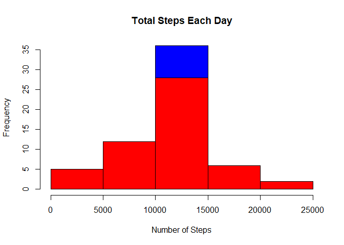
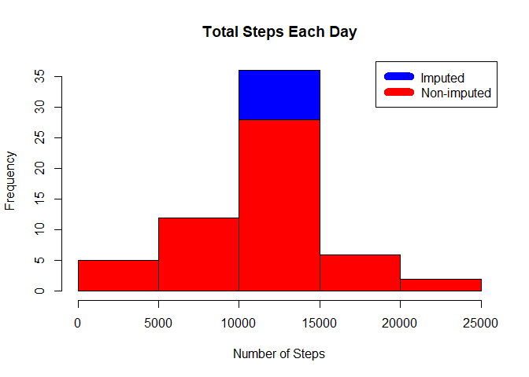

## Data
The data for this assignment was downloaded from the course web
site:

* Dataset: [Activity monitoring data](https://d396qusza40orc.cloudfront.net/repdata%2Fdata%2Factivity.zip) [52K]

#Loading and preprocessing the data


```r
library(markdown)
```

```
## Warning: package 'markdown' was built under R version 3.4.3
```

```r
library(readr)
activity <- read_csv("~/R Programming Assignment/Reproducible Research Assignment 1/activity.csv")
```

```
## Parsed with column specification:
## cols(
##   steps = col_integer(),
##   date = col_date(format = ""),
##   interval = col_integer()
## )
```

```r
View(activity)
```

#What is mean total number of steps taken per day?


```r
steps_by_day <- aggregate(steps ~ date, activity, sum)
hist(steps_by_day$steps, main = paste("Total Steps Each Day"), col="blue", xlab="Number of Steps")
```

<!-- -->

```r
rmean <- mean(steps_by_day$steps)
rmedian <- median(steps_by_day$steps)
```

The mean is 10766.18 and the median is 10765.

#What is the average daily activity pattern?


```r
steps_by_interval <- aggregate(steps ~ interval, activity, mean)

plot(steps_by_interval$interval,steps_by_interval$steps, type="l", xlab="Interval", ylab="Number of Steps",main="Average Number of Steps per Day by Interval")
```

<!-- -->

```r
max_interval <- steps_by_interval[which.max(steps_by_interval$steps),1]
```

The interval containing the largest number of steps is 835.

#Impute missing values. Compare imputed to non-imputed data.

This method uses the average interval value to replace missing data.


```r
incomplete <- sum(!complete.cases(activity))
imputed_data <- transform(activity, steps = ifelse(is.na(activity$steps), steps_by_interval$steps[match(activity$interval, steps_by_interval$interval)], activity$steps))
```

Recount total steps by day and create Histogram. 

```r
steps_by_day_i <- aggregate(steps ~ date, imputed_data, sum)
hist(steps_by_day_i$steps, main = paste("Total Steps Each Day"), col="blue", xlab="Number of Steps")
```

<!-- -->

```r
#Create Histogram to show difference. 
hist(steps_by_day$steps, main = paste("Total Steps Each Day"), col="red", xlab="Number of Steps", add=T)
```

<!-- -->

```r
legend("topright", c("Imputed", "Non-imputed"), col=c("blue", "red"), lwd=10)
```

<!-- -->

Calculate new mean and median for imputed data. 

```r
rmean.i <- mean(steps_by_day_i$steps)
rmedian.i <- median(steps_by_day_i$steps)
```

Calculate difference between imputed and non-imputed data.

```r
mean_diff <- rmean.i - rmean
med_diff <- rmedian.i - rmedian
```

Calculate total difference.

```r
total_diff <- sum(steps_by_day_i$steps) - sum(steps_by_day$steps)
```
* The imputed data mean is 1.0766189\times 10^{4}
* The imputed data median is 1.0766189\times 10^{4}
* The difference between the non-imputed mean and imputed mean is 0
* The difference between the non-imputed mean and imputed mean is 1.1886792
* The difference between total number of steps between imputed and non-imputed data is 8.6129509\times 10^{4}. Thus, there were 8.6129509\times 10^{4} more steps in the imputed data.


## Are there differences in activity patterns between weekdays and weekends?
Created a plot to compare and contrast number of steps between the week and weekend. There is a higher peak earlier on weekdays, and more overall activity on weekends.  

```r
weekdays <- c("Monday", "Tuesday", "Wednesday", "Thursday", 
              "Friday")
imputed_data$dow = as.factor(ifelse(is.element(weekdays(as.Date(imputed_data$date)),weekdays), "Weekday", "Weekend"))

steps_by_interval_i <- aggregate(steps ~ interval + dow, imputed_data, mean)

library(lattice)

xyplot(steps_by_interval_i$steps ~ steps_by_interval_i$interval|steps_by_interval_i$dow, main="Average Steps per Day by Interval",xlab="Interval", ylab="Steps",layout=c(1,2), type="l")
```

<!-- -->

